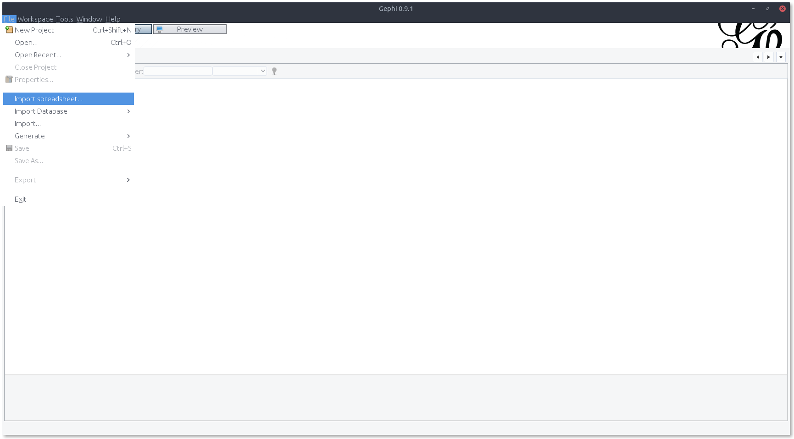
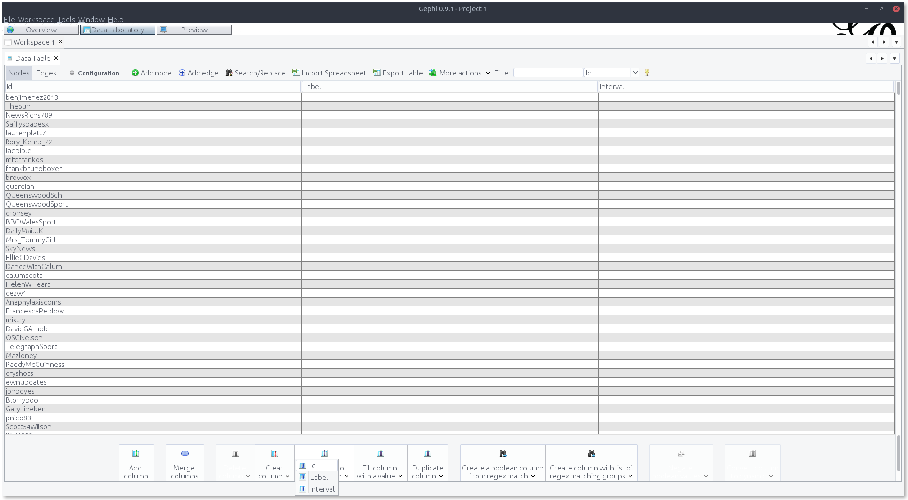
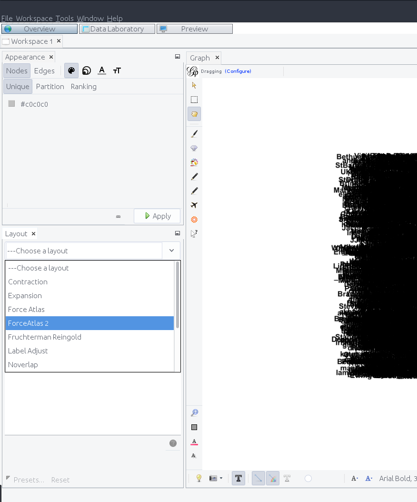
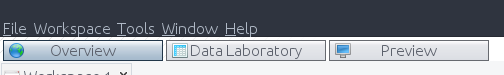

# Tutorial 4

Open up [this file](files/tut4/comu3120_group.csv) in Gephi and explore

Use the [Scraping guide](gephi.html) and the [Quick start guide](https://gephi.org/tutorials/gephi-tutorial-quick_start.pdf)

## Your Tasks

1. Clean up the file to include `Source` and `Target` columns

   Open it in OpenRefine

   Rename `from.name` to `Source`

   Add a column named `Target` based on `original_post.from.name`

   `if(isNonBlank(row.cells["parent.from.name"]), row.cells["parent.from.name"].value, value)`

2. Import into Gephi

   

3. Copy the `Id` column into the `Label`

   

4. Show labels and adjust their size

   

5. Adjust the edge thickness

6. Use the `Layout` window to adjust the graph's appearance

   

7. Rank nodes with size by their `Degree`

   

8. In the `Statistics Window`, find the `Average Degree`, `Network diameter` and `Modularity` of the graph

   

9. Apply the `Modularity Class` partition to see communities

   

10. Apply the `Degree Range` filter to remove the less connected nodes

   

11. Adjust the settings in the `Preview` window to export the file

    

## Scrape each of the following from Reaper and clean them up for Gephi:

1. Facebook post comments: `110233818125_10155191101963126`
2. Twitter 10000 tweets: `Go to twitter.com and scrape something from the trending list on the left`
3. Reddit subreddit's top 100 threads top 500 comments: `listentothis`

